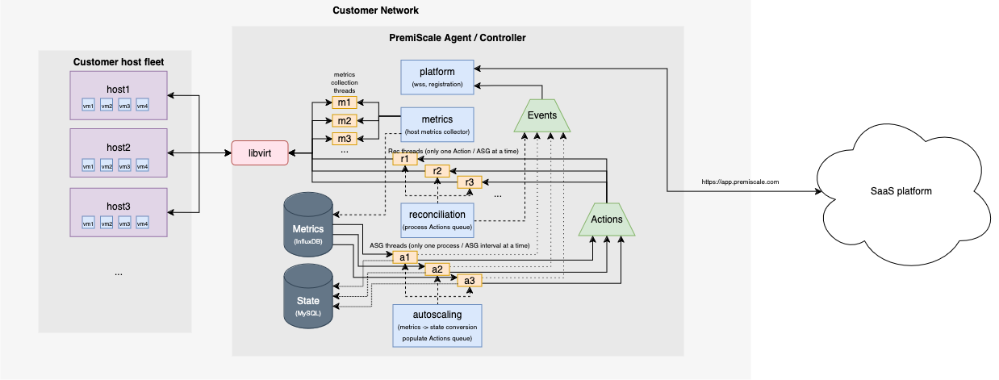

# PremiScale

PremiScale brings autoscaling to on-premise infrastructure, with a particular focus on integrating with the [Kubernetes autoscaler](https://github.com/kubernetes/autoscaler).

<!-- [[[cog
import subprocess
import cog

cog.outl(f'```text\n$ premiscale --help\n{subprocess.run("poetry run premiscale --help".split(" "), stdout=subprocess.PIPE, stderr=subprocess.DEVNULL).stdout.decode()}\n```')
]]] -->
```text
$ premiscale --help
usage: premiscale [-h] [--token TOKEN] [-d] [-c CONFIG] [--validate]
                  [--version] [--pid-file PID_FILE]
                  [--log-level {info,error,warn,debug}]
                  [--log-file LOG_FILE | --log-stdout] [--platform PLATFORM]
                  [--cacert CACERT]

PremiScale autoscaler. © PremiScale, Inc. 2024

options:
  -h, --help            show this help message and exit
  --token TOKEN         Platform registration token. (default: )
  -d, --daemon          Start agent as a daemon. (default: False)
  -c CONFIG, --config CONFIG
                        Configuration file path to use. (default:
                        /opt/premiscale/config.yaml)
  --validate            Validate the provided configuration file and exit.
                        (default: False)
  --version             Display agent version. (default: False)
  --pid-file PID_FILE   Pidfile name to use for the agent daemon. (default:
                        /opt/premiscale/premiscale.pid)
  --log-level {info,error,warn,debug}
                        Set the logging level. (default: info)
  --log-file LOG_FILE   Specify the file the service logs to if --log-stdout
                        is not set. (default: /opt/premiscale/agent.log)
  --log-stdout          Log to stdout (for use in containerized deployments).
                        (default: False)
  --platform PLATFORM   URL of the PremiScale platform. (default:
                        app.premiscale.com)
  --cacert CACERT       Path to the certificate file (for use with self-signed
                        certificates). (default: )

```
<!-- [[[end]]] (checksum: d213a43bd2ea46b8a4f2d190362f6d77) -->

## Architecture

PremiScale is a controller that works by

See the [architecture diagram](https://drive.google.com/file/d/1hjwaMVQESdU2KffEJ4FpWDC1hjVHCLZX/view?usp=sharing) for PremiScale, or check out the diagram below, for an overview of just the controller.

<p align="center" width="100%">
  
</p>

## Development

### Dependencies

Install [asdf](https://asdf-vm.com/guide/getting-started.html#_1-install-dependencies), followed by running `asdf install` in the root of this project.

### Local

```shell
yarn compose:up
```

This will bring up a number of services, including platform services that the controller registers and connects to for billing. When you're finished, run

```shell
yarn compose:down
```

### Remote

Connect to your development cluster of choice with kubectl access, followed by

```shell
devspace
```

This will bring up a development stack in a local or remote Kubernetes cluster of your choice.

### Tests

Run unit tests with

```shell
poetry run pytest tests/unit
```

e2e tests against a live environment with

```shell
poetry run pytest tests/e2e
```

And coverage against the codebase with

```shell
poetry run coverage run -m pytest
poetry run coverage report -m pytest
```
